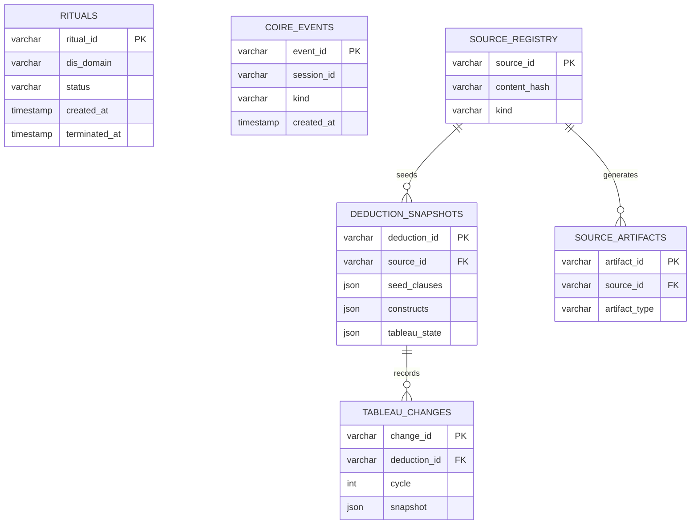
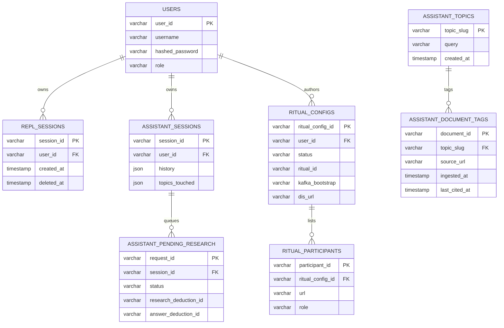
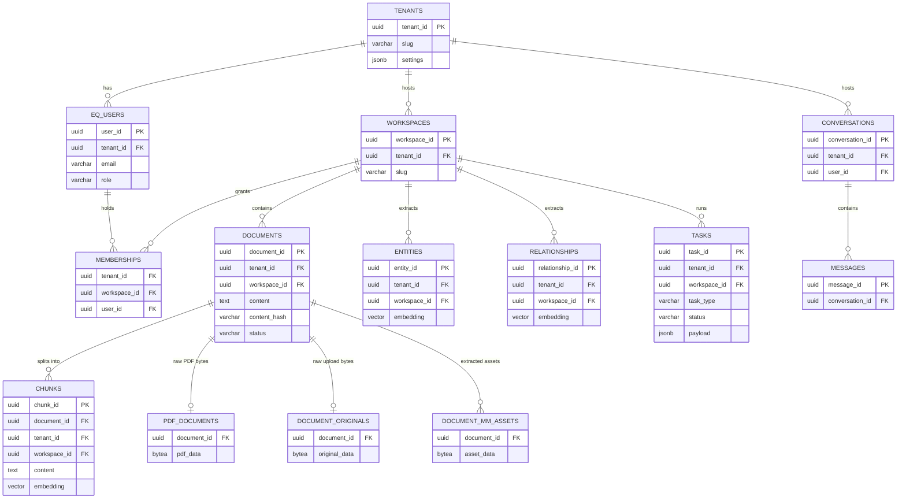
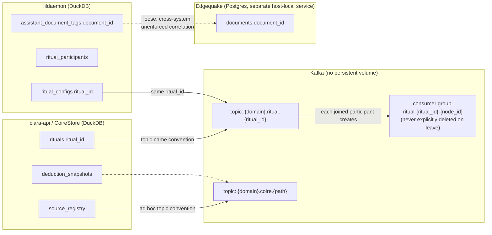

# Clara stack data ERD

**Status:** Reference documentation, verified live 2026-09-06 against the
real schema/containers on `limbic`.

Three independent persistence layers make up the Clara stack's data, plus
Kafka as the connective tissue between two of them. There is no single
shared database — each system below owns its own storage, and the
relationships between them are correlated by shared ID conventions
(ritual ids, document ids), not enforced foreign keys.

## 1. CoireStore (clara-api, DuckDB — `data/coire.duckdb`)

`RitualRegistry` write-throughs to `rituals` on every create/join/
terminate and reloads *all* rows (active and terminated) on every
clara-api boot — a past incident let 250 dead rituals accumulate because
`terminate()` never deletes the row (`clara-ritual/src/registry.rs`).
`FieryPitRegistry` (which FieryPits are currently registered/discoverable)
is deliberately **not** here — it's pure in-memory, re-populated by
heartbeat, nothing to persist.

## 2. lildaemon (Python, DuckDB — `lildaemon.duc`)

lildaemon holds only a *tag* mirror of Edgequake documents
(`assistant_document_tags`) — never the documents/chunks/embeddings
themselves. `ritual_configs.ritual_id` correlates to CoireStore's
`rituals.ritual_id` once a config is activated, but that's a cross-system
reference, not an enforced FK (see §4).

## 3. Edgequake (Rust, Postgres 18 + pgvector 0.8.5 + Apache AGE 1.8.0 —
one named Docker volume `edgequake-pg-data`, own compose project)

Not shown as static entities, since they're not fixed schema:
- **Apache AGE graph data** — nodes/edges live inside the same Postgres
  instance via the AGE extension (Cypher queries against a graph catalog,
  not ordinary tables), scoped by `workspace_id` property on each node.
- **Per-workspace dynamic vector tables** — beyond the static
  `chunks.embedding`/`entities.embedding`/`relationships.embedding`
  columns, each workspace also gets its own dedicated vector table named
  `eq_<namespace>_ws_<uuid-short>_vectors` with its own HNSW index sized
  to that workspace's embedding provider. A plain `TRUNCATE chunks` does
  **not** clear these — see `reset_edgequake_clara_workspace.sh`, which
  uses Edgequake's own scoped workspace-wipe endpoint instead of raw SQL.

Every core table carries `tenant_id`/`workspace_id`, enforced by
Row-Level Security — this is a genuinely multi-tenant instance, not
Clara-exclusive, even though it currently only runs on `limbic` for
Clara's own use.

## 4. How Kafka ties CoireStore and lildaemon together

Not a real ERD relationship (no FK, no shared database) — Kafka topic
names and IDs are the only connective tissue, and Ritual consumer groups
have no database row at all:

## Verification

Schema confirmed live against the running containers:
`duckdb data/coire.duckdb ".tables"`,
`duckdb lildaemon/data/lildaemon.duc ".tables"`, and
`docker exec edgequake-postgres psql -U edgequake -d edgequake -c '\dt'`
(and `\dGe`/AGE catalog for graph data) should each match the tables
listed above — re-run these after any schema-changing migration to keep
this doc accurate.
